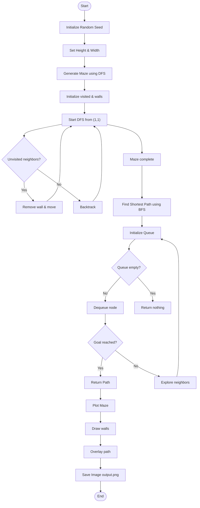

# Maze Generator & Solver in Julia

A high-performance maze generator and solver built using **Julia**.  
This project demonstrates core algorithmic techniques by combining:

- 🏗️ Depth-First Search (DFS) for maze generation  
- 🧭 Breadth-First Search (BFS) for shortest path finding  
- 🎨 Visualization using `Plots.jl` (GR backend)  

---

## 🚀 Overview

This program:

1. Generates a random maze
2. Finds the shortest path from start to goal
3. Visualizes the maze with the solution path
4. Saves the output as an image (`output.png`)

---

## 📦 Dependencies

Install required packages:

```julia
using Pkg
Pkg.add("Plots")

```
---

🏗️ Maze Generation (DFS)
🔹 Function: generate_maze(height, width)

Generates a random maze using Depth-First Search (DFS) with backtracking.

---

🧠 Key Components

$visited$ → Tracks visited cells

$h_{walls}$ → Horizontal walls

$v_{walls}$ → Vertical walls

$stack$ → DFS traversal structure

---

⚙️ Working

1. Start from (1,1)
2. Randomly explore neighbors
3. Remove walls between connected cells
4. Backtrack when no moves are available

---

🚪 Entry & Exit

`Entry` → Top-left corner

`Exit` → Bottom-right corner

---

🧭 Shortest Path (BFS)
🔹 Function: `find_shortest_path(...)`

Finds the shortest path using Breadth-First Search (BFS).

🧠 Key Concepts
Queue stores (position, path)

Level-by-level exploration

Avoids revisiting nodes using visited

⚙️ Working

1. Start from (1,1)
2. Explore valid neighbors
3. Avoid walls using wall matrices
4. Stop when goal (height, width) is reached

📌 Output

Returns full path as list of coordinates

Returns nothing if no path exists

🎨 Visualization
🔹 Function: `plot_maze_fast(...)`

Efficiently renders the maze using `Plots.jl`.

🧠 Features 

1. Draws horizontal and vertical walls
2. Uses NaN to separate line segments
3. Overlays shortest path in red
4. Maintains correct aspect ratio

🏁 Main Execution
🔹 Function: `main()`

Steps:

1. Set random seed
2. Define maze size
3. Generate maze
4. Compute shortest path
5. Plot and save output

``` julia
Random.seed!(42)

height = 300
width = 300

h_walls, v_walls = generate_maze(height, width)
path = find_shortest_path(height, width, h_walls, v_walls)

p = plot_maze_fast(height, width, h_walls, v_walls, path)

savefig(p, "output.png")
```

📊 Output

Generates a 300×300 maze

Highlights shortest path in red

Saves as:

`output.png`

## Flow of Execution 

